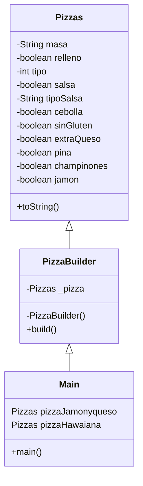
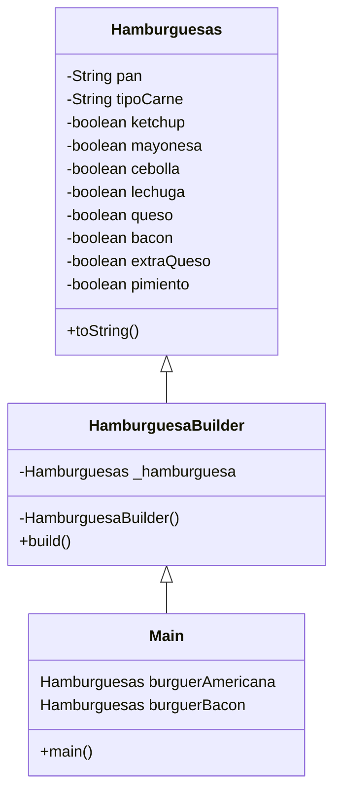

# Patrón Builder

Es un patrón de diseño creacional que nos permite construir objetos complejos paso a paso. 
El patrón nos permite producir distintos tipos y representaciones de un objeto empleando el mismo código de construcción.

Este patrón sugiere que saques el código de construcción del objeto de su propia clase y lo coloques dentro de objetos independientes llamados constructores.

Por ejemplo, la creación de una hamburguesa, que dependiendo del cliente o los tipos de hamburguesa que se tengan en carta
será necesario añadir unos ingredientes u otros.

## Diagrama de clases

## Combinación con otros patrones

Este patrón se podría utilizar con el patrón factory, de manera que el patrón factory devuelva un Builder de nuestra clase concreta
y utilizar este Builder para construir tantos objetos como queramos con los atributos que necesitemos.